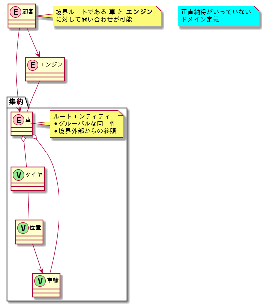
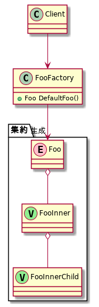
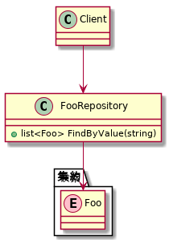

# エリックエヴァンス ドメイン駆動設計 第3回
## 第6章 ドメインオブジェクトのライフサイクル
ドメインモデルのライフサイクル管理についてみたいな

ドメインオブジェクトの `生成・再構成 - 保存 - 削除` までを、実装でどう実現すべきか的なことをつらつらと書いてる。

ドメインモデルと実装をなるべく自然に結びつけるためのことがメインな感じ。 
今まで書かれていたのは `要件定義 ~ 基本設計` あたりの話だったが、この章では `基本設計 ~ 詳細設計` あたりが焦点。

**実装的な話が多くなってくるくせに、実際のコードがないためわかるけどわからない状態が続く**

なんとなくデザインパターンとかわかってたりすれば結構すんなり頭に入ってくる気がするけど、そうじゃない人にはこの章は **抽象的なくせにやたら具体的** という意味がわからない自体になると思う。
PGじゃない人がDDD本を読んだ場合の挫折ポイント何じゃないかと思う。

集約(AGGREGATES)はまだ `基本設計` よりな話で、これまでの章との関連性も感じられるけど、それ以降のファクトリ(FACTORIES)とリポジトリ(REPOSITORIES)は実装よりでデザインパターン云々の話になってくる。


## 一言まとめ
**責務を適切に分離し、分析モデルと設計モデルの乖離を防ぐテクニック**

---

## 集約(AGGREGATES)
**関連するオブジェクトの集まり**

複雑な関連性を持つドメインはもういろいろ辛いので、よく考えてグルーピングしようね！

### 集約の例


### キーワード
* ルートエンティティ
  - 他の集約から参照される
  - 集約内のオブジェクトへのアクセスを制御
    + `顧客` から `タイヤ` にアクセスするためには `車` への問い合わせが必要
* 同一性
  - ユニークなIDが割り当てられる系
* 不変条件
  - モデルが有効である間、常に一貫している必要がある状態のこと
  - 集約内のオブジェクトは不変条件を守ること
    + 勝手オブジェクトの値とか変えるなみたいなことだと思ふ


## ファクトリ(FACTORIES)
集約がでかくなると、オブジェクトの生成が辛くなるからそういう役割を隠蔽しようぜ

### 複雑な集約の例

```go
type Foo struct {
    Value string
    Inner FooInnser
}

type FooInnser struct {
    Value string
    Child FooInnerChild
}

type FooInnerChild struct {
    Value string
}

// Fooを利用するクライアント
func client() {
    // クライアントに生成させるのは酷 && 集約のルートエンティティ以外を意識してしまう
    foo := Foo{
        Value: "foo",
        Inner: FooInnser{
            Value: "fooinner",
            Child: FooInnerChild{
                Value: "fooinnerchild",
            },
        }
    }

    // ここから実際のドメインモデルの処理
}
```

#### 何がだめ？
* 集約のルートエンティティ以外を操作している
* オブジェクトの生成が複雑化すればするほど、ドメインモデルに基づく処理が分かりづらくなる

### 適当にFactoryを使ってみる

```go
type Foo struct {
    Value string
    Inner FooInnser
}

type FooInnser struct {
    Value string
    Child FooInnerChild
}

type FooInnerChild struct {
    Value string
}

type FooFactroy struct {}

func (FooFactroy) DefaultFoo() Foo {
    return Foo{
        Value: "foo",
        Inner: FooInnser{
            Value: "fooinner",
            Child: FooInnerChild{
                Value: "fooinnerchild",
            },
        }
    }
}

// Fooを利用するクライアント
func client() {
    // ファクトリを使って集約を生成することで責務が別れてきれいな設計に。
    // クライアントが集約内部を意識する必要がなくなる
    factory := new(FooFactroy)
    foo := factory.DefaultFoo()

    // ここから実際のドメインモデルの処理
}
```

#### 何がいい？
* クライアントの処理が簡潔になる
* ドメインモデルの処理に集中できる


### Factoryを利用した例のクラス図


集約の生成方法は他にもいろいろ

* ビルダーパターン
* ファクトリメソッド
* etc...

**責務を分離することが大事**


## リポジトリ(REPOSITORIES)
**インフラストラクチャを隠蔽して、ドメインモデルをクリーンにする**

データの保存とか検索とかが利用してる技術(インフラストラクチャ)に依存してくると、せっかく設計したドメインモデルが崩壊するからリポジトリでいい感じに隠蔽しようね

### インフラストラクチャを隠蔽できていない例

```go
type Foo struct {
	Value string
}

func client(db *sql.DB) {
	// 技術的な要素が目立ってしまう
	rows, _ := db.Query("SELECT * FROM foo WHERE value = ?", "foo")
	foos := make([]Foo, 0)
	for rows.Next() {
		var value string
		rows.Scan(&value)
		foos = append(foos, Foo{
			Value: value,
		})
	}

    // ここから実際のドメインモデルの処理
	...
}
```

#### 何がだめ？
* クライアントが本来ドメインモデルと関係のないデータベースへのアクセスを意識してしまう
* インフラストラクチャが目立ってしまうため、分析モデルがインフラストラクチャに引きづられがちになってしまう
  - 処理書くの辛いからモデルをDBに合わせようみたいな

### 適当にRepositoryを導入してみる
```go
type Foo struct {
	Value string
}

type FooRepository struct {
	db *sql.DB
}

func (f FooRepository) FindByValue(value string) []Foo {
	rows, _ := f.db.Query("SELECT * FROM foo WHERE value = ?", "foo")
	foos := make([]Foo, 0)
	for rows.Next() {
		var value string
		rows.Scan(&value)
		foos = append(foos, Foo{
			Value: value,
		})
	}
}

func client(r FooRepository) {
	foos := r.FindByValue("foo")
    // ここから実際のドメインモデルの処理
}
```

#### 何がいい？
* インフラストラクチャへの処理が隠蔽でき、処理が簡潔になる
* クライアントがドメインモデルの処理に集中できるため、何が起こっているのかわかりやすい

### Repositoryを利用した例のクラス図


---

## 感想
実装時に分析したドメインモデルを崩さないようにしよう && そのためにはどういうプログラム設計にすればいいの？みたいなことをつらつらと書かれてる

**集約** 以外はほぼほぼデザインパターンに関することを書いてるわけだけど、すぐに実用できるほど具体的には書かれてない。

最初の方にも書いたけど、実装したことない系の人が読むと頭パンクするんじゃね？という感じがする。
